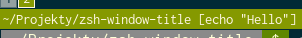

# zsh-windows-title


A simple zsh plugin that dynamically sets your terminal window title.

It displays your current working directory and last run command

## Installation
### zplugin
```
zplugin light mdarocha/zsh-window-title
```
